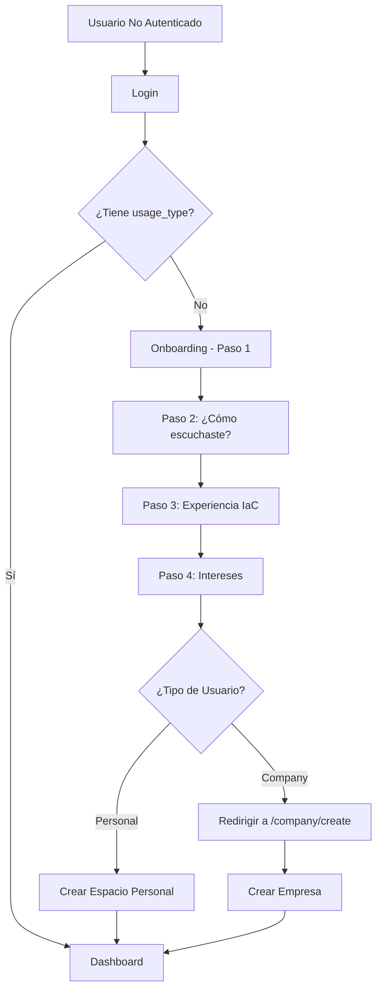

# Resumen de Correcciones del Flujo de Autenticación y Onboarding

## Problemas Identificados y Solucionados

### 1. **Flujo de Onboarding de 4 Pasos**
El onboarding no es un simple formulario con un botón "Siguiente", sino un flujo complejo de 4 pasos:

- **Paso 1**: Selección de tipo de uso (Personal/Company)
- **Paso 2**: ¿Cómo escuchaste de nosotros?
- **Paso 3**: Experiencia con IaC
- **Paso 4**: Intereses + Botón "Finalizar Onboarding"

**Solución**: Actualicé los tests E2E para manejar correctamente este flujo multi-paso.

### 2. **Protección de la Página create-company**
La página `/create-company` era pública y no verificaba:
- Si el usuario estaba autenticado
- Si había completado el onboarding

**Solución**:
1. Moví la página a `/company/create` dentro de la carpeta `(app)` para aprovechar el layout de autenticación
2. Agregué verificaciones de seguridad adicionales:
```typescript
// Verificar autenticación
if (!isAuthenticated()) {
  router.replace('/login');
  return;
}

// Verificar onboarding completado
if (!user.usage_type) {
  router.replace('/onboarding/select-usage');
  return;
}
```

### 3. **Flujo Correcto Después del Onboarding**
- **Usuarios Personales**: Van directo al dashboard (se crea espacio personal automáticamente)
- **Usuarios Company**: Van a `/company/create` para crear su empresa

### 4. **Tests E2E Actualizados**
Creé nuevos archivos de test que manejan correctamente el flujo completo:
- `usage-type-complete-flow.spec.ts`: Tests completos del flujo de 4 pasos
- `onboarding-simple-test.spec.ts`: Test simplificado para debugging

## Archivos Modificados

1. **`infraux/app/(app)/company/create/page.tsx`** (nueva ubicación)
   - Movida desde `/create-company` a `/company/create`
   - Agregada verificación de autenticación
   - Agregada verificación de onboarding completado
   - Agregado estado de carga mientras se verifican permisos
   - Optimizada para evitar delays en la verificación

2. **Archivos actualizados con la nueva ruta**:
   - `infraux/app/page.tsx`
   - `infraux/app/components/multi-tenant/CompanySelector.tsx`
   - `infraux/app/components/Navigation.tsx`
   - `infraux/app/components/ui/CompanySidebar.tsx`
   - `infraux/app/(app)/layout.tsx`
   - `infraux/app/(app)/onboarding/select-usage/page.tsx`
   - `infraux/__tests__/unit/frontend/components/multi-tenant/CompanySelector.test.tsx`
   - `infraux/__tests__/e2e/auth/usage-type-complete-flow.spec.ts`

## Flujo de Autenticación Completo



## Usuarios de Prueba Disponibles

1. **new-user@infraux.com** - Usuario nuevo sin onboarding
2. **personal-user@infraux.com** - Usuario personal con onboarding
3. **company-user@infraux.com** - Usuario empresa con onboarding
4. **e2e-test@infraux.com** - Usuario para pruebas E2E

Todos con contraseña: `NewUser123!`

## Próximos Pasos Recomendados

1. **Agregar propiedad `companies` al tipo User**:
   ```typescript
   export interface User {
     // ... propiedades existentes
     companies?: Array<{id: string, name: string}>;
   }
   ```

2. **Implementar verificación de compañías para usuarios personales**:
   - Un usuario personal solo debería tener una compañía (su espacio personal)
   - Evitar que accedan a `/company/create` si ya tienen su espacio

3. **Mejorar el middleware de autenticación**:
   - Agregar `/company/create` a las rutas protegidas que requieren onboarding completado

4. **Agregar tests de seguridad**:
   - Verificar que usuarios no autenticados no puedan acceder a rutas protegidas
   - Verificar que usuarios sin onboarding no puedan acceder a `/company/create`

## Comandos para Ejecutar Tests

```bash
# Test simple del flujo completo
npm run test:e2e -- __tests__/e2e/auth/onboarding-simple-test.spec.ts --headed

# Test completo con todos los escenarios
npm run test:e2e -- __tests__/e2e/auth/usage-type-complete-flow.spec.ts --headed

# Todos los tests de autenticación
npm run test:e2e -- __tests__/e2e/auth/ --headed