# 🧪 Tests E2E para Tipos de Uso: Personal y Company

## 📋 Escenarios de Prueba

### 1. Usuario Nuevo - Flujo Personal
```
Login → Onboarding (Seleccionar Personal) → Dashboard Personal
```

### 2. Usuario Nuevo - Flujo Company
```
Login → Onboarding (Seleccionar Company) → Crear Empresa → Dashboard Company
```

### 3. Usuario Existente - Personal
```
Login → Dashboard Personal (sin onboarding)
```

### 4. Usuario Existente - Company
```
Login → Dashboard Company (sin onboarding)
```

## 🔑 Usuarios de Prueba Necesarios

### Para el flujo completo necesitamos:

1. **Usuario Nuevo (sin usage_type)**
   - Email: `new-user@infraux.com`
   - Password: `NewUser123!`
   - Estado: Sin `usage_type` definido

2. **Usuario Personal Existente**
   - Email: `personal-user@infraux.com`
   - Password: `Personal123!`
   - usage_type: `personal`

3. **Usuario Company Existente**
   - Email: `company-user@infraux.com`
   - Password: `Company123!`
   - usage_type: `company`
   - company_id: `test-company-123`

## 📝 Test Completo: `usage-type-flows.spec.ts`

```typescript
import { test, expect } from '@playwright/test';
import { LoginPage } from '../pages/login.page';
import { OnboardingPage } from '../pages/onboarding.page';
import { DashboardPage } from '../pages/dashboard.page';

test.describe('Flujos por Tipo de Uso', () => {
  let loginPage: LoginPage;
  let onboardingPage: OnboardingPage;
  let dashboardPage: DashboardPage;
  
  test.beforeEach(async ({ page }) => {
    loginPage = new LoginPage(page);
    onboardingPage = new OnboardingPage(page);
    dashboardPage = new DashboardPage(page);
    
    // Limpiar datos previos
    await page.evaluate(() => {
      localStorage.clear();
      sessionStorage.clear();
    });
  });
  
  test('Usuario nuevo selecciona uso PERSONAL', async ({ page }) => {
    // 1. Login con usuario nuevo
    await loginPage.goto();
    await loginPage.fillEmail('new-user@infraux.com');
    await loginPage.fillPassword('NewUser123!');
    await loginPage.clickSubmit();
    
    // 2. Debería redirigir a onboarding
    await expect(page).toHaveURL(/.*onboarding\/select-usage/);
    
    // 3. Seleccionar uso personal
    await onboardingPage.selectPersonalUsage();
    await onboardingPage.clickContinue();
    
    // 4. Debería ir directo al dashboard (sin crear empresa)
    await expect(page).toHaveURL(/.*dashboard/);
    
    // 5. Verificar que es dashboard personal
    const welcomeText = await dashboardPage.getWelcomeMessage();
    expect(welcomeText).toContain('Personal');
    
    // 6. Verificar que NO hay selector de empresa
    const companySelector = page.locator('[data-testid="company-selector"]');
    await expect(companySelector).not.toBeVisible();
  });
  
  test('Usuario nuevo selecciona uso COMPANY', async ({ page }) => {
    // 1. Login con usuario nuevo
    await loginPage.goto();
    await loginPage.fillEmail('new-user2@infraux.com');
    await loginPage.fillPassword('NewUser123!');
    await loginPage.clickSubmit();
    
    // 2. Debería redirigir a onboarding
    await expect(page).toHaveURL(/.*onboarding\/select-usage/);
    
    // 3. Seleccionar uso empresarial
    await onboardingPage.selectCompanyUsage();
    await onboardingPage.clickContinue();
    
    // 4. Debería redirigir a crear empresa
    await expect(page).toHaveURL(/.*create-company/);
    
    // 5. Crear empresa
    await page.fill('[name="companyName"]', 'Mi Empresa Test');
    await page.click('button:has-text("Crear")');
    
    // 6. Debería ir al dashboard de empresa
    await expect(page).toHaveURL(/.*dashboard/);
    
    // 7. Verificar que es dashboard de empresa
    const companyName = page.locator('[data-testid="company-name"]');
    await expect(companyName).toContainText('Mi Empresa Test');
  });
  
  test('Usuario PERSONAL existente va directo al dashboard', async ({ page }) => {
    // Login con usuario personal existente
    await loginPage.goto();
    await loginPage.fillEmail('personal-user@infraux.com');
    await loginPage.fillPassword('Personal123!');
    await loginPage.clickSubmit();
    
    // Debería ir directo al dashboard (sin onboarding)
    await expect(page).toHaveURL(/.*dashboard/);
    await expect(page).not.toHaveURL(/.*onboarding/);
    
    // Verificar tipo personal
    const profileData = await page.evaluate(() => {
      return JSON.parse(localStorage.getItem('infraux_user') || '{}');
    });
    expect(profileData.usage_type).toBe('personal');
  });
  
  test('Usuario COMPANY existente va directo al dashboard', async ({ page }) => {
    // Login con usuario company existente
    await loginPage.goto();
    await loginPage.fillEmail('company-user@infraux.com');
    await loginPage.fillPassword('Company123!');
    await loginPage.clickSubmit();
    
    // Debería ir directo al dashboard (sin onboarding)
    await expect(page).toHaveURL(/.*dashboard/);
    await expect(page).not.toHaveURL(/.*onboarding/);
    
    // Verificar tipo company
    const profileData = await page.evaluate(() => {
      return JSON.parse(localStorage.getItem('infraux_user') || '{}');
    });
    expect(profileData.usage_type).toBe('company');
    expect(profileData.company_id).toBeTruthy();
  });
  
  test('Cambiar de PERSONAL a COMPANY', async ({ page }) => {
    // 1. Login como usuario personal
    await loginPage.goto();
    await loginPage.fillEmail('personal-user@infraux.com');
    await loginPage.fillPassword('Personal123!');
    await loginPage.clickSubmit();
    
    // 2. Ir a configuración
    await page.click('[data-testid="settings-link"]');
    
    // 3. Cambiar a uso empresarial
    await page.click('button:has-text("Cambiar a Empresa")');
    
    // 4. Debería redirigir a crear empresa
    await expect(page).toHaveURL(/.*create-company/);
    
    // 5. Crear empresa
    await page.fill('[name="companyName"]', 'Nueva Empresa');
    await page.click('button:has-text("Crear")');
    
    // 6. Verificar cambio
    const profileData = await page.evaluate(() => {
      return JSON.parse(localStorage.getItem('infraux_user') || '{}');
    });
    expect(profileData.usage_type).toBe('company');
  });
});
```

## 🔄 Flujos Visuales por Tipo

### Flujo Personal:

```mermaid
graph LR
    A[Login] --> B{¿Tiene usage_type?}
    B -->|No| C[Onboarding]
    B -->|Sí: personal| D[Dashboard Personal]
    C --> E[Seleccionar Personal]
    E --> D
    D --> F[Sin selector de empresa]
    D --> G[Vistas simplificadas]
```


### Flujo Company:

```mermaid
graph LR
    A[Login] --> B{¿Tiene usage_type?}
    B -->|No| C[Onboarding]
    B -->|Sí: company| D[Dashboard Company]
    C --> E[Seleccionar Company]
    E --> F[Crear Empresa]
    F --> D
    D --> G[Selector de empresa]
    D --> H[Gestión de equipo]
```


## 🛠️ Helpers Adicionales Necesarios

### 1. `user-type.helpers.ts`
```typescript
export async function createUserWithType(
  email: string,
  password: string,
  usageType?: 'personal' | 'company'
) {
  // Crear usuario en Supabase
  // Si usageType está definido, actualizar el perfil
}

export async function switchUsageType(
  page: Page,
  from: 'personal' | 'company',
  to: 'personal' | 'company'
) {
  // Navegar a settings
  // Cambiar tipo de uso
  // Manejar redirecciones
}
```

### 2. Actualizar `OnboardingPage`
```typescript
export class OnboardingPage {
  // ... métodos existentes ...
  
  async isOnSelectUsagePage(): Promise<boolean> {
    return this.page.url().includes('/onboarding/select-usage');
  }
  
  async waitForUsageSelection(): Promise<void> {
    await this.page.waitForURL('**/onboarding/select-usage');
  }
  
  async getSelectedUsageType(): Promise<string | null> {
    // Obtener el tipo seleccionado
  }
}
```

## 📊 Matriz de Pruebas

| Escenario | Usuario | Estado Inicial | Acción | Resultado Esperado |
|-----------|---------|----------------|--------|-------------------|
| Nuevo Personal | new-user | Sin usage_type | Selecciona Personal | Dashboard Personal |
| Nuevo Company | new-user | Sin usage_type | Selecciona Company | Crear Empresa → Dashboard |
| Existente Personal | personal-user | usage_type: personal | Login | Dashboard Personal directo |
| Existente Company | company-user | usage_type: company | Login | Dashboard Company directo |
| Cambio P→C | personal-user | usage_type: personal | Cambiar a Company | Crear Empresa |
| Cambio C→P | company-user | usage_type: company | Cambiar a Personal | Confirmar → Dashboard Personal |

## 🚀 Comandos de Ejecución

```bash
# Ejecutar solo tests de tipos de uso
npx playwright test usage-type-flows

# Ejecutar con usuario específico
npx playwright test -g "Usuario nuevo selecciona uso PERSONAL"

# Ver flujo visual
npx playwright test usage-type-flows --headed --workers=1
```

## ✅ Checklist de Implementación

- [ ] Crear usuarios de prueba con diferentes estados
- [ ] Implementar tests para flujo personal
- [ ] Implementar tests para flujo company
- [ ] Verificar redirecciones correctas
- [ ] Validar datos en localStorage
- [ ] Probar cambios de tipo de uso
- [ ] Documentar comportamientos edge case